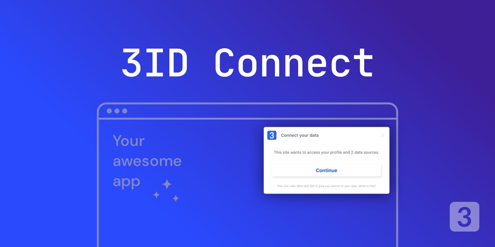

#  3ID-Connect

3ID user account management in a iframe. An easy way to access a did provider, specifically [ThreeIdProvider](https://github.com/ceramicstudio/js-3id-did-provider) in the browser. It allows users to authenticate, manage, link and permission their 3ID keys to applications. The library [js-3id-did-provider](https://github.com/ceramicstudio/js-3id-did-provider) handles most operations and the parent window (application) communicates with the iframe service over an RPC layer. 3id-connect with Ceramic support is only available at 3id-connect@next and 3idconnect.org at the moment.

## Folders

- [`connect`](./connect): 3ID Connect iframe and library
- [`management`](./management): 3ID accounts management UI
- [`public`](./public): build assets
